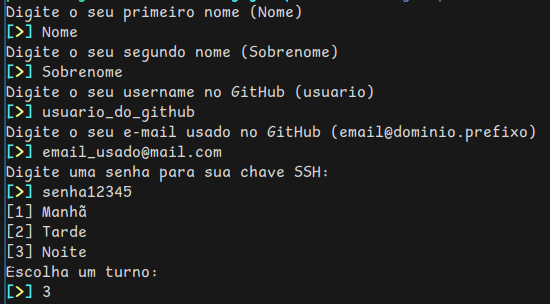

# Gitup

Este script foi criado para facilitar a configuração e organização de ambientes de desenvolvimento individuais para os alunos de forma automatizada, organizada e controlada. Ele permite criar uma estrutura de pastas, definir configurações e possibilita ajustes específicos para cada alunos.

---
## 1. Pré-requisitos

- Shell Bash (compatível com distribuições Linux, macOS e Windows por Git-Bash)
- Acesso ao Git e SSH instalados no sistema
- Permissões de escrita no diretório onde ocorrera a criação de pastas

---
## 2. Configurações

Antes de tudo verifique se os parâmetros estão definidos de acordo com o seu caso de uso.

Por padrão a criação da pasta e subpastas destinadas aos alunos é feita no mesmo diretório onde o script é executado. Esta seria a configuração ideal para simular e/ou testar o funcionamento
do script. Porém para uso em prod, é recomendado que altere o valor dos parâmetros a baixo para o recomendado ou para um diretório de sua preferência.

```bash
# ==========================================================
# ==== ALTERE AQUI ===== ALTERE AQUI ===== ALTERE AQUI =====

# Exemplo para testes oi simulação (Windows com gitbash) FUCK MICROSOFT!:
# > Caso em linux basta utilizar a variável $PWD ao inves desta gambiarra
# diretorio_base_fullpath="$(cygpath.exe -m $PWD)/alunos"
# git_config_padrao_fullpath="$(cygpath.exe -m $PWD)/.gitconfig"
# ssh_pasta_padrao_fullpath="$(cygpath.exe -m $PWD)/.ssh"

# Exemplo para ambiente de produção (Windows com gitbash) FUCK MICROSOFT!:
# > Caso em linux basta utilizar a variável $HOME ao inves desta gambiarra
diretorio_base_fullpath="$(cygpath.exe -m $USERPROFILE)/documents/alunos"
git_config_padrao_fullpath="$(cygpath.exe -m $USERPROFILE)/.gitconfig"
ssh_pasta_padrao_fullpath="$(cygpath.exe -m $USERPROFILE)/.ssh"

# ==========================================================
```

> Essas variáveis definem caminhos e configurações para os diretórios e arquivos onde estarão as pastas dos alunos.

---
## 3. Fluxo e funcionamento

O fluxo é divido em algumas etapas, cada uma desempenhando uma função vital.

- Inserção das informações do aluno
- Criação de pastas e arquivos de configuração padrão
- Criação da pasta do aluno
- Criação de arquivos de configuração do aluno
- Inclusão de diretivas para inclusão das configurações do aluno
- Geração de chave ssh para o aluno

---

### 3.1 Inserção das informações do aluno

Como é possível ver no exemplo a abaixo, logo no começo do script são requisitados algumas informações importantes sobre o aluno, estas informações serão
utilizadas para geração de pastas e configurações.



### 3.2 Criação de pastas e arquivos de configuração padrão

Nesta etapa, o script verifica se as pastas e os arquivos de configuração padrão já existem. Caso não sejam encontrados, ele prossegue automaticamente com a criação das pastas
e criação dos arquivos com base nos templates utilizados.
### 3.3-4 Criação da estrutura de pastas e arquivos do Aluno

O script verifica a existência da pasta do aluno e caso a pasta não exista então segue com a criação.
> Essa pasta é nomeada no formato `NOME_SOBRENOME_TURNO` (usando somente as três primeiras letras do turno).

É feita a verificação dos arquivos de configuração, caso não existam então ele cria novos arquivos para configuração `git` e `ssh` se baseando nos templates.
### 3.5 Inclusão de diretivas para inclusão das configurações do aluno

Aqui acontece a inclusão de um tipo de diretiva responsável por importar a configuração do aluno como parte
da configuração padrão utilizada pelo `git`e pelo `ssh`, primeiramente ele verifica se já existe uma diretiva que aponta
para o caminho da configuração daquele aluno na configuração padrão, caso ela não exista então é adicionada uma nova diretiva.
### 3.6 Geração de chave ssh para o aluno

Esta etapa representa a fase final do processo, onde ocorre a geração da chave SSH que será utilizada pelo aluno para autenticar operações de Git nos repositórios criados dentro da sua pasta específica. A chave SSH é essencial para estabelecer uma conexão segura entre o ambiente local do aluno e o GitHub, ela que permite a autenticação de operações como clone, push e pull de maneira mais segura.
## 4. Como utilizar

### 4.1 Passos de bebê
1. Clone este repositório para a sua máquina
   ```bash
   git clone https://github.com/paodelonga/gitup.git
   ```

2. Acesse o diretório do projeto
   ```bash
   cd gitup
   ```

	**Ou** utilize a ferramenta curl para fazer somente o download do script diretamente no seu diretório atual
```bash
curl -O https://raw.githubusercontent.com/paodelonga/gitup/refs/heads/main/gitup.bash
```

3. Defina as permissões de execução do script:
```bash
chmod +x ./gitup.bash
```

4. E finalmente execute o script:
```bash
./gitup.bash
```

### 4.2

---
